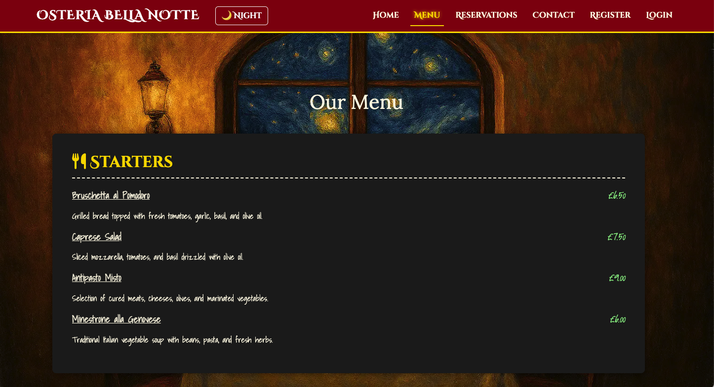
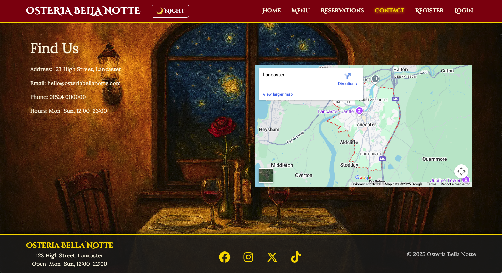
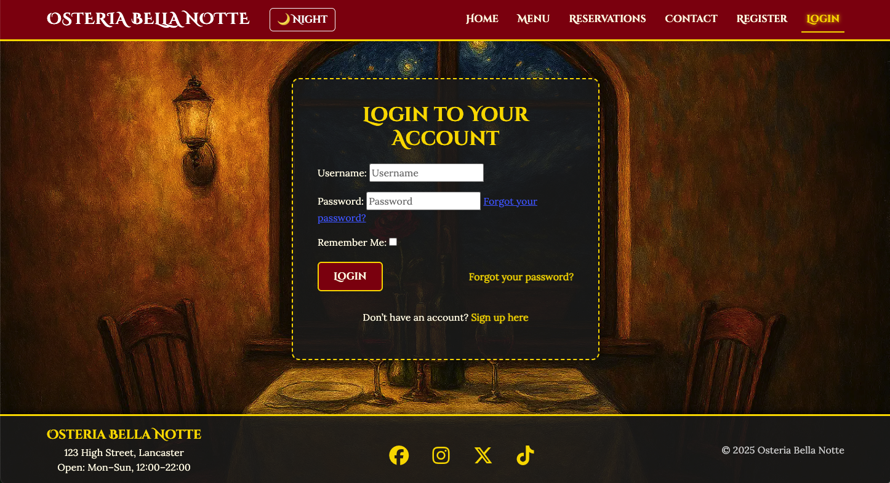
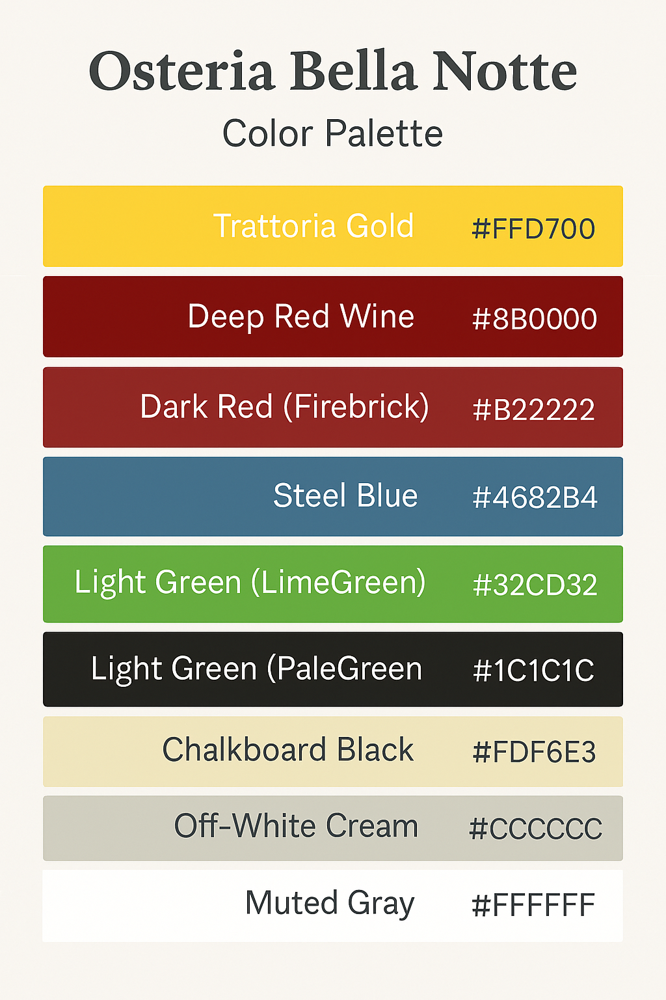
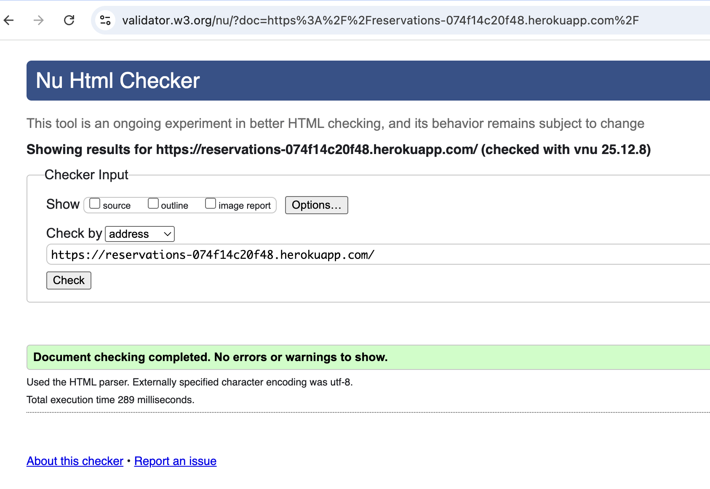
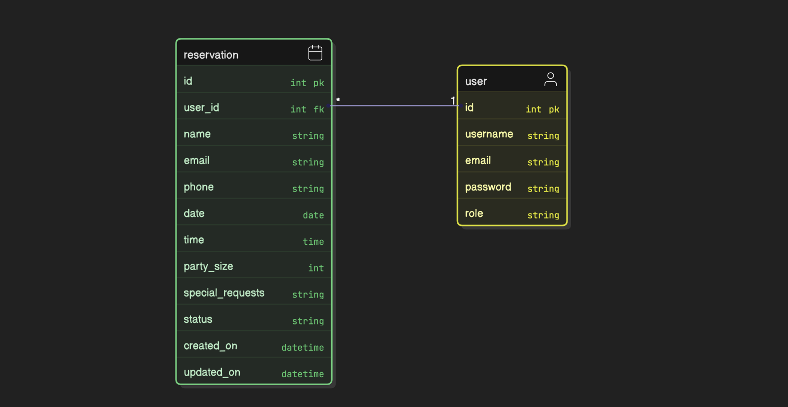
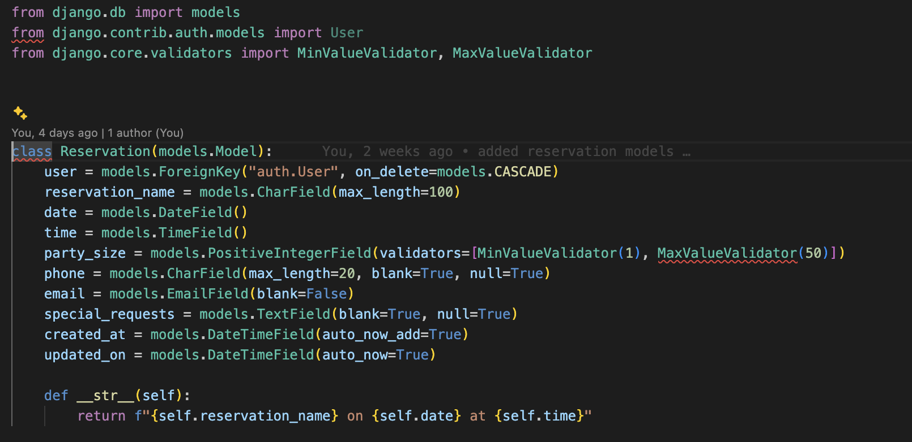
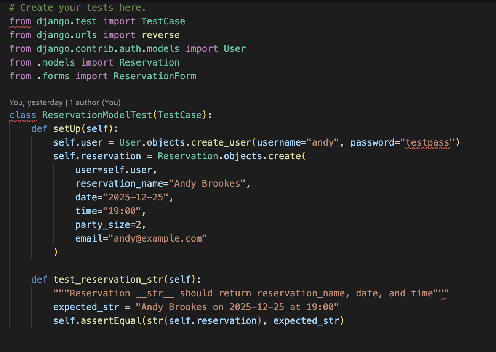
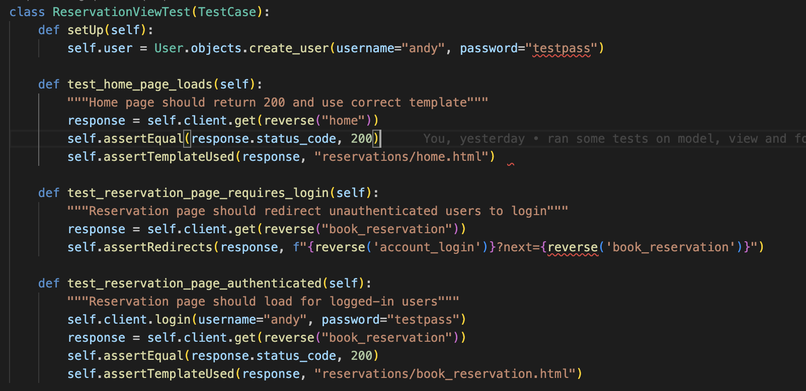
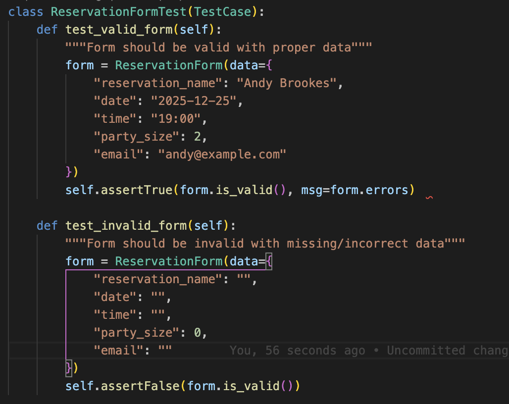

# capstone-project

#  Restaurant Reservation  System 

# Live Site https://reservations-074f14c20f48.herokuapp.com/ 

## 📑 Table of Contents

1. [Project Overview](#-project-overview)
2. [UX Design Process](#-ux-design-process)
3. [Agile Development](#-agile-development)
4. [User Stories](#user-stories)
5. [Color Scheme](#-color-scheme)
6. [Database & Models](#-database--models)
7. [CRUD Functionality](#-crud-functionality)
8. [Authentication & Roles](#-authentication--roles)
9. [Testing](#-testing)
10. [Version Control & Security](#-version-control--security)
11. [Deployment](#8-deployment--httpsreservations-074f14c20f48herokuappcom-)
12. [AI Integration & Reflection](#-ai-integration--reflection)
13. [Conclusion](#-conclusion)
14. [Acknowledgements](#-acknowledgements)


## Project Overview
**Purpose:** My project is a Full‑stack Django application for managing a fictional restaurant's reservations. 
It allows customers to book, view, edit, and cancel reservations online and provide admins with tools to manage capacity and confirm/cancel bookings. I lived in Italy for four years so I can confirm the menu is authentic(and quite reasonabley priced!)

I aimed to deliver a polished, accessible, and responsive user experience across devices. 
**Features:** Responsive front‑end, CRUD functionality, role‑based authentication, notifications, deployment to cloud.  
**Tech Stack:** Django, Python, HTML/CSS/Bootstrap, Javascript, PostgreSQL, Cloudinary, Heroku.
## 2. UX Design Process
**Wireframes & Mockups:**

**Balsamiq Wireframe**


**Apple devices mockup**


**Homepage**

  

**Menu**
  
  

**Reservation form**

   

**Reservation success page**
  

**Contact Page**
  

  
**Login Page**
  

**Sign-up**

  
**Sign-out**

  


**My Reservations**
  

**Admin dashboard**
  


 
  
- **Design Rationale:** Explanation of layouts, colours, and accessibility choices.  


## 🎨 Color Scheme

- **Gold (#ffd700):** accents, borders, highlights
- **Deep Red Wine (#8b0000):** navbar, reserve buttons
- **Firebrick Red (#b22222):** sign-out actions
- **Steel Blue (#4682b4):** sign-in highlights
- **LimeGreen (#32CD32):** confirmation success
- **PaleGreen (#90ee90):** menu prices
- **Chalkboard Black (#1c1c1c):** menu & footer backgrounds
- **Cream (#fdf6e3):** body text
- **Muted Gray (#ccc):** secondary text
- **White (#fff):** hover highlights




I wanted it to be a sophisticated but earthy Italian restuarant booking website. Warm trattoria tones, chalkboard-style menus, gold accents for a touch of class.
Clear typography and immersive layout - font-family: 'Cinzel Decorative’, gives a great effect with the interlocking O’ in Booking. Also used serif.

- **Accessibility:** WCAG compliance, semantic HTML, alt text, ARIA labels.  



- **Responsiveness:** Screenshots of mobile/tablet/desktop views.
Optimized for mobile/tablet/desktop with touch-friendly buttons and adaptive layout

---
---
## 🚀 Agile Development

I adopted an Agile methodology during the development of my **Restuarant reservation system**, using the **MoSCoW prioritisation method** to ensure essential features were delivered first. A public GitHub Project Board was used to manage user stories, tasks, and track progress.

### 📋 Project Board Structure
- **Backlog** – planned features and ideas  
- **To Do** – items ready to be developed  
- **In Progress** – features currently under development  
- **Done** – completed and tested work  

Each card contained a user story with clear acceptance criteria and was labelled as:
- **Must Have** – essential functionality required for the application’s purpose  
- **Should Have** – important improvements that enhance the experience but are not critical  
- **Could Have** – optional enhancements to include if time permitted  


### ✅ Benefits of This Approach
- Delivered working features early and consistently  
- Allowed transparent tracking and easy prioritisation adjustments  
- Maintained flexibility to add improvements without losing sight of core functionality  


## User Stories https://github.com/users/Andybrookes-dev/projects/5
**MUST HAVE**

**User Story 1** - Reservation Booking - As a Customer
I can book a reservation online with my details and party size.

**User story 2** - Reservation Management - As a customer, I want to view, edit, or cancel my reservations,
So that I can manage my bookings easily.

**User Story 3** - Admin Reservation Control - As an admin, I want to view all reservations and confirm or cancel them, so that I can manage restaurant capacity and operations.

**User Story 4** - Role-Based Authentication - As a user
I want to register and log in securely, so that I can access features appropriate to my role (customer or admin).

**User Story 5** - Responsive & Accessible Front-End - As a visitor, I want the site to be responsive and accessible, so that I can use it comfortably on any device and meet accessibility standards.

**User Story 6** - Testing & Quality Assurance - As a developer, I want automated tests for models, views, and forms, so that I can ensure the application works correctly and is maintainable.

**SHOULD HAVE**

**User Story 7** - Deployment & Security - As a developer,
I want to deploy the application to a cloud platform with environment variables, so that the app is secure, production‑ready, and matches the local version.

**User Story 8** - AI Integration & Reflection - As a developer, I want to use AI tools for scaffolding, debugging, and optimization, so that I can accelerate development and document how AI improved workflow and UX.

**User Story 9** - Consistent Layout & Styling - As a visitor, I want consistent styling across all pages,
so that the site feels professional and easy to navigate.

**User Story 10** - Code Structure & Maintainability - As a developer, I want modular, well‑structured code, So that the project is easy to maintain and extend.


## Database & Models
 **Initial planned Schema Diagram (ERD):** Showing relationships between User, Reservation, Table, Post.
  


**Stripped back ERD for deployed app:** Showing relationships between User and Reservation.



 **Custom Models:**
  - **Reservation** – guest info, date/time, party size, status.

  

  - **Table** – number, capacity, location.  *This will be a future addition 
  - **Post** – blog content, author, timestamps. *This will be a future addition 
  ### 🌞🌙 Day/Night Mode Toggle
The site includes a dynamic theme switcher that lets users toggle between **day** and **night** backgrounds:

- **CSS Classes:**  
  - `body.day-mode` → applies the daytime background image.  
  - `body.night-mode` → applies the nighttime background image.  
  - A smooth transition is achieved with `transition: background-image 0.8s ease-in-out`.

- **Button:**  
  A toggle button in the navbar (`#toggleMode`) starts in “🌙 Night” mode and updates its label when clicked.

- **JavaScript Logic:**  
  The script listens for button clicks and swaps the `day-mode` / `night-mode` classes on `<body>`.  
  ```js
  toggleBtn.addEventListener("click", function() {
      if (body.classList.contains("night-mode")) {
          body.classList.replace("night-mode", "day-mode");
          toggleBtn.textContent = "☀️ Day";
      } else {
          body.classList.replace("day-mode", "night-mode");
          toggleBtn.textContent = "🌙 Night";
      }
  });

- **Constraints:**
  - Party size > 0  
  - Reservation ≤ table capacity  - No table model or blog post model in current version

  - One active reservation per user

  - No double bookings
- **Migrations:** Document schema changes and version control.

---

## CRUD Functionality
- **Create:** Reservation form pre-filled user data
- **Read:** Reservation list,   
- **Update:** Edit reservation/post.  
- **Delete:** Cancel reservation/post.  
- **Access Control:** Customers manage their own reservations, admins manage all.

---

## Authentication & Roles
- **Registration/Login:** Custom forms with and immersive styling.  
### ✅ Reservation Form Validation
The reservation form enforces several business rules to ensure data integrity and a smooth user experience:

- **Date Validation:**  
  Reservations cannot be made in the past. The form checks that the selected date is today or later.

- **Time Validation:**  
  Reservations are only allowed during service hours (12:00 PM – 10:00 PM). Any time outside this range is rejected.

- **Email Validation:**  
  An email address is required for every reservation. The form enforces this with Django’s `EmailField` and custom validation.

- **Party Size Validation:**  
  Party size must be greater than zero and capped at 50. This is enforced with both model validators (`MinValueValidator`, `MaxValueValidator`) and form‑level checks for user‑friendly error messages.

- **Widgets:**  
  - HTML5 date and time pickers (`type="date"`, `type="time"`) for intuitive input.  
  - A multi‑line textarea for special requests.

**Result:**  
Users receive clear, friendly error messages when inputs are invalid, while the database remains protected by strict model‑level constraints.


- **Roles:** Customer (default), Staff/Admin.  
- **Login State Reflection:** Navbar shows login/logout, conditional rendering.  
- **Access Control:** Restricted views based on role.

---

## Testing
- **Python Tests:** Unit tests for models, views, forms; integration tests for booking flow.  
**Model Test**


**View Test**


**Form Test**

- **JavaScript Tests (if applicable):** Client‑side validation checks.  
- **Accessibility Tests:** Lighthouse/WAVE results.  
- **Responsiveness Tests:** Screenshots across devices.  
- **Testing Documentation:**
  - Table of test cases, expected vs actual results.
  - Key findings and fixes.

---

## Version Control & Security
- **GitHub Repo:** Link to repository.  https://github.com/Andybrookes-dev/capstone-project.git
- **Commit History:** Screenshots showing descriptive commit messages.  
- **Secure Code Management:**
  - `.env` for secrets  
  - `.gitignore` excludes sensitive files  
  - No hardcoded passwords or API keys

---

## Deployment : https://reservations-074f14c20f48.herokuapp.com/ 
- **Platform:** Heroku (with Postgres + Cloudinary).  
- **Deployment Steps:**
  1. Install Heroku CLI  
  2. Create app, add buildpacks  
  3. Configure environment variables  
  4. Push code, run migrations, collectstatic  
- **Verification:** Screenshots of deployed app.  
- **Security:** `DEBUG = False`, `ALLOWED_HOSTS` set, secrets in env vars.

---

## AI Integration & Reflection
- **Code Creation:** AI helped me with some ideas for my models, and views.  
- **Debugging:** I did a lot of the debugging by eye but when I was stumped I used AI which identified/fixed migration errors.  
- **Optimization:** AI suggested UX improvements (messages framework, styling).  
- **Reflection:**
  AI was particularly useful during the overall process, although you have to be mindful, use it in incremental steps, and understand the code when it starts telling you incorrect ways!

---

## Conclusion
- **Summary:**  I really enjoyed working on this project. I did find it challenging, but in a way that pushed me to improve as a developer. My initial deployments were pain free, but after styling the site, I spent about a day working out why I was getting a 500 error. It transpired that I had my static folder in my gitignore! I feel I have built an app that has CRUD functionality and the website reflects my creative design skills.
  
- **Future Improvements:** Features to add -table availability checker and email notifications. I did intially look to add these but ultimatley i decided to keep my project simple for now. I will look to implement a similar model to *The OpenTable model which is used by many different restuarants). See below

***OpenTable's Core Components in Coding Terms:**

**Data Models (Entities):**

- **Restaurant:** Stores details (location, menu, reviews, custom floor plan).

- **Table:** Has attributes like table_id, capacity (seats), location_on_floor, status (occupied, free, reserved).

- **Reservation:** reservation_id, guest_id, restaurant_id, party_size, time_slot, status (confirmed, seated, no-show), notes (special requests, guest history).

- **Guest:** guest_id, name, contact_info, booking_history, preferences.

- **AvailabilitySlot:** Represents specific 15-min blocks for a given table_id, tracking available_spots for different party_sizes.
  
## **Acknowledgements:** 
A big thank you to Mark, Dillon and Tom - my tutors at Code institute for their awesome wisdom and support. I used Mark's brilliant masterclass as a guide when setting up the Django project and Dillon and Tom suggested ways to test the site's functionality. 
