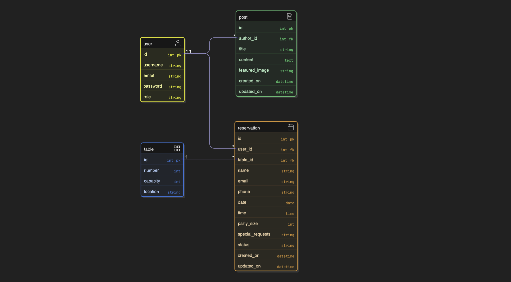

# capstone-project

#  Restaurant Reservation & Blog System – Capstone Project

## 1. Project Overview
**Purpose:** Full‑stack Django application for managing restaurant reservations.  
**Features:** Responsive front‑end, CRUD functionality, role‑based authentication, notifications, deployment to cloud.  
**Tech Stack:** Django, Python, HTML/CSS/Bootstrap, Javascript, PostgreSQL, Cloudinary, Heroku.

---

## 2. UX Design Process
- **Wireframes & Mockups:**
  - Homepage
  - Reservation form & and success page.
  - Auth views (login, signup)
  - Admin dashboard
  - Confirmation and cancellation dialogs

- **Design Rationale:** Explanation of layouts, colours, and accessibility choices.  

I wanted it to be a sophisticated but earthy Italian restuarant. Warm trattoria tones, chalkboard-style menus, gold accents for a touch of class.
Clear typography and immersive layout - font-family: 'Cinzel Decorative’, gives a great effect with the interlocking O’ in Booking. serif;

- **Accessibility:** WCAG compliance, semantic HTML, alt text, ARIA labels.  
- **Responsiveness:** Screenshots of mobile/tablet/desktop views.
Optimized for mobile/tablet/desktop with touch-friendly buttons and adaptive layout

---

## 3. Database & Models
- **Schema Diagram (ER):** Show relationships between User, Reservation, Table, Post.


- **Custom Models:**
  - **Reservation** – guest info, date/time, party size, status.
  - **Table** – number, capacity, location.
  - **Post** – blog content, author, timestamps.
  ### 🌞🌙 Day/Night Mode Toggle
The site includes a dynamic theme switcher that lets users toggle between **day** and **night** backgrounds:

- **CSS Classes:**  
  - `body.day-mode` → applies the daytime background image.  
  - `body.night-mode` → applies the nighttime background image.  
  - A smooth transition is achieved with `transition: background-image 0.8s ease-in-out`.

- **Button:**  
  A toggle button in the navbar (`#toggleMode`) starts in “🌙 Night” mode and updates its label when clicked.

- **JavaScript Logic:**  
  The script listens for button clicks and swaps the `day-mode` / `night-mode` classes on `<body>`.  
  ```js
  toggleBtn.addEventListener("click", function() {
      if (body.classList.contains("night-mode")) {
          body.classList.replace("night-mode", "day-mode");
          toggleBtn.textContent = "☀️ Day";
      } else {
          body.classList.replace("day-mode", "night-mode");
          toggleBtn.textContent = "🌙 Night";
      }
  });

- **Constraints:**
  - Party size > 0  
  - Reservation ≤ table capacity  - No table model or blog post model in current version

  - One active reservation per user

  - No double bookings
- **Migrations:** Document schema changes and version control.

---

## 4. CRUD Functionality
- **Create:** Reservation form pre-filled user data
- **Read:** Reservation list,   
- **Update:** Edit reservation/post.  
- **Delete:** Cancel reservation/post.  
- **Access Control:** Customers manage their own reservations, admins manage all.

---

## 5. Authentication & Roles
- **Registration/Login:** Custom forms with and immersive styling.  
- **Roles:** Customer (default), Staff/Admin.  
- **Login State Reflection:** Navbar shows login/logout, conditional rendering.  
- **Access Control:** Restricted views based on role.

---

## 6. Testing
- **Python Tests:** Unit tests for models, views, forms; integration tests for booking flow.  
- **JavaScript Tests (if applicable):** Client‑side validation checks.  
- **Accessibility Tests:** Lighthouse/WAVE results.  
- **Responsiveness Tests:** Screenshots across devices.  
- **Testing Documentation:**
  - Table of test cases, expected vs actual results.
  - Key findings and fixes.

---

## 7. Version Control & Security
- **GitHub Repo:** Link to repository.  https://github.com/Andybrookes-dev/capstone-project.git
- **Commit History:** Screenshots showing descriptive commit messages.  
- **Secure Code Management:**
  - `.env` for secrets  
  - `.gitignore` excludes sensitive files  
  - No hardcoded passwords or API keys

---

## 8. Deployment : https://reservations-074f14c20f48.herokuapp.com/ 
- **Platform:** Heroku (with Postgres + Cloudinary).  
- **Deployment Steps:**
  1. Install Heroku CLI  
  2. Create app, add buildpacks  
  3. Configure environment variables  
  4. Push code, run migrations, collectstatic  
- **Verification:** Screenshots of deployed app.  
- **Security:** `DEBUG = False`, `ALLOWED_HOSTS` set, secrets in env vars.

---

## 9. AI Integration & Reflection
- **Code Creation:** AI helped me with some ideas for my models, and views.  
- **Debugging:** I did a lot of the debugging by eye but when I was stumped I used AI whichidentified/fixed migration errors.  
- **Optimization:** AI suggested UX improvements (messages framework, styling).  
- **Reflection:**
  - How AI accelerated development  
  - How AI supported debugging  
  - How AI improved UX/performance  
  - Impact on workflow efficiency

---

## 10. Conclusion
- **Summary:** How the project meets all capstone criteria. - I really enjoyed working on this project. I did find it challenging, but in a way that pushed me to improve as a developer. My initial deployments were pain free, but after styling the site, I spent about a day working out why I was getting a 505. It transpired that I had my static folder in my gitignore! I feel I have built an app that has CRUD functionality and the website reflects my creative design skills.
  
- **Future Improvements:** Features to add (e.g., table availability checker, email notifications).  
- **Acknowledgements:** Tools, resources, and AI support.
